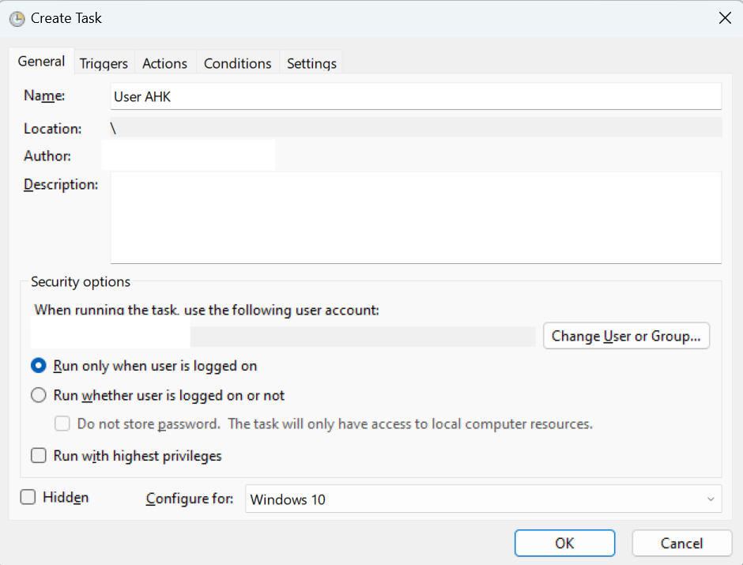
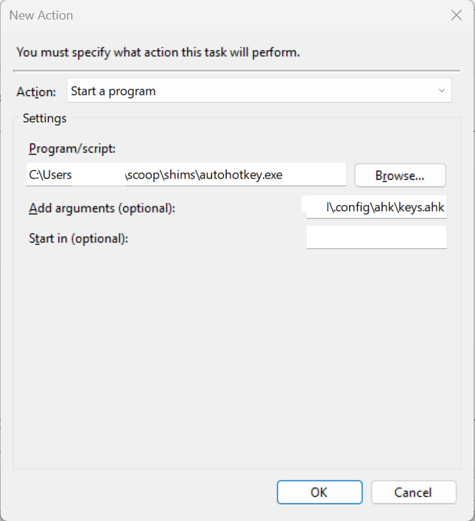
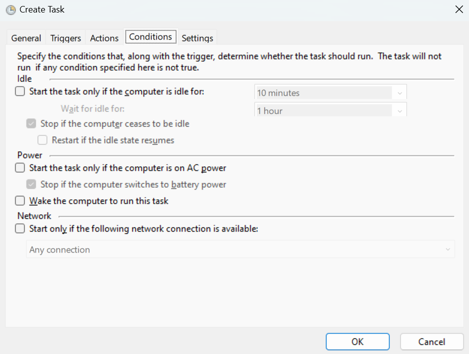

# My Windows Dotfiles
As I have always used Arch Linux and Window Tilling Managers on my own, when I
moved for working for Microsoft using Windows again was a challenge. In this
documentation, you'll find everything that I did and all my dotfiles for my
Windows installation in order to make it as similar as possible for maximizing
performance.

## Setup
To setup my dotfiles, first clone the bare repository in the desired place.

```powershell
git clone --bare git@github.com:juanscr/windows_dotfiles.git
```

Then, use the following command to get all the files from the repository and, for
usability, stop showing files not uploaded to git.

```powershell
Function DotfilesGit {git --git-dir=$HOME\path\to\repository --work-tree=$HOME @args}
Set-Alias -name dfiles -Value DotfilesGit
dfiles config status.showUntrackedFiles no
dfiles restore --staged .
dfiles checkout .
```

And there you go. Happy tinkering!
## Table of Contents
- [Programs I install](#programs)
- [My PowerToys config](#power-toys)
- [AutoHotkey at LogOn](#ahk-setup)
- [WinUtil for the win](#winutil)

<a name="programs"></a>
## Programs
First, as a package manager I use [scoop](https://github.com/ScoopInstaller/Scoop).
After installing `scoop` I install the following programs through it:

- `neovim`: Text command line editor. For my installation to work, it must also
be installed `zig` and `node` for treesitter support.
- `git`: Version control.
- `sudo`: Sudo for windows.
- `eza`: Ls but in Rust.
- `komorebi`: Tilling window management for windows.
- `autohotkey`: Automate scripts and bind to keybinds.
- `unzip`: Unzip utility.

Additionally, through the windows store I install:

- [Power Toys](https://github.com/microsoft/PowerToys): Windows system
utilities for power users.

<a name="power-toys"></a>
## My Power Toys Configuration

<a name="ahk-setup"></a>
## Setting up AHK at LogIn
It is a good idea to setup AutoHotkeys to run when you login to your system, so you
have everything setup and running when you login with your user. This can be done
simply with the Task Scheduler provided by Windows.

To setup the task, first open the Task Schedule and create a new task. At the general
tab, make sure to change the "Configure for:" option to "Windows 10" as such:



After that, setup a new trigger, select "At log on" as the trigger and change to
only run when "Specific user:" is yours (it should be automatically set if you are
logged in as your user). Then, set the action and as the script set the path to the
`autohotkey` executable and, as an argument, the path to the autohotkey configuration
you want. You should have something similar as:



Lastly, go to the conditions tab and remove the checkmark so it runs the task
everytime, even if the computer is not connect to AC as such:



<a name="winutil"></a>
## WinUtil Tweaks
[WinUtil](https://christitustech.github.io/winutil/) is a set of windows utilities and
set of scripts for customizing the Windows experience for a more minimal and faster
experience. I have found this pretty useful as it automates a lot of valuable tasks and
debloating easily my Windows installation.

The following tweaks I apply are:

- Disable ConsumerFeatures
- Disable Telemetry
- Disable GameDVR
- Disable hibernation
- Disable homegroup
- Disable wifi sense
- Change Windows Terminal default: PowerShell 5 -> PowerShell 7
- Disable Powershell 7 Telemetry
- Set services to manual

I also turn off the following features:

- Bing Search in Start Menu
- Snap Window
- Snap Assist Flyout
- Snap Assist Suggestion

I also suggest running once in a while the "Run Disk Cleanup" for cleaning up
storage space.
